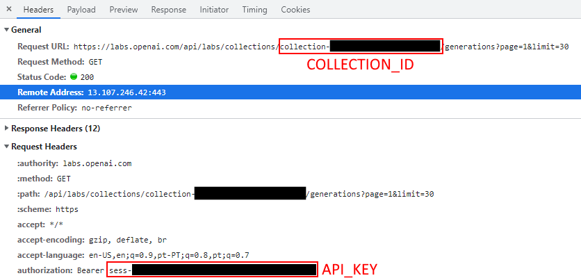

# DALL-E Exporter

## Setup

Setup a `.env` file in this folder:
```
COLLECTION_ID=collection-REDACTED
API_KEY=sess-REDACTED
FOLDER=~/Pictures/dall-e_collection
```

To find out your `COLLECTION_ID` and `API_KEY` observe your browser network requests when loading https://labs.openai.com/c/private. The request you're looking for starts with `https://labs.openai.com/api/labs/collections/collection-`.




## Running

Run the program with `just`.
